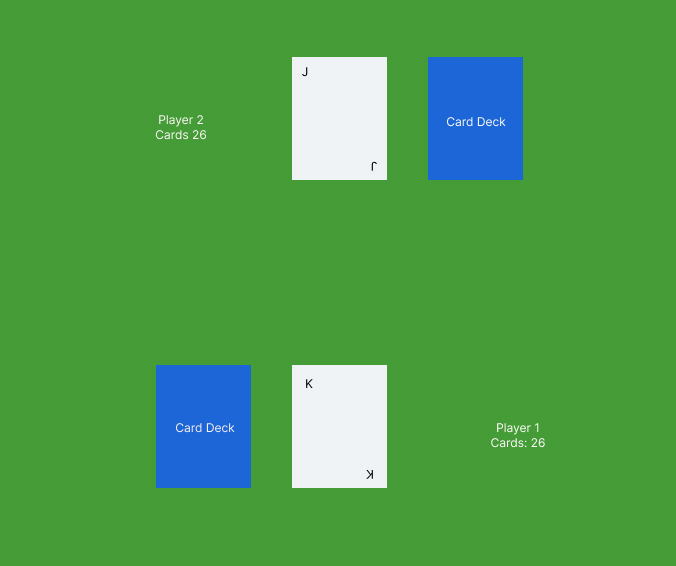

# Classic War Card Game

## Project Description
One player browser game variation of traditional war card game. 

For each hand, players will turn up cards at the same time and the player with the higher card takes both cards and adds them to their deck. If the cards are the same rank, war is initiated and each player will place a card face down and another face up. The player with the higher rank will take all six cards. 
Play continues until there is one player with all 52 cards. The game ends when one player has won all 52 cards.

Note - this game version has two war scenarios built in.

## Planning
### Wire Frame

## Game Functionality
### Screenshots

- Click on Player 1 deck to draw and display a card

- The entirety of the game is played on this screen
- The player will click through the deck until the win scenario is acheived. 

- A message is displayed after each hand who is the winner or in this case, if it is War

- When won either the player or the computer has all 52 cards, a win or lose message is displayed.

## Technologies Used
- JavaScript
- HTML
- CSS

## Getting Started
### Link to Game
https://vvela2022.github.io/Classic-War-Browser-Game/

To get started, click the below link. Once on the page, click the player deck to begin.

### Project Difficulties
- Implementation of War both logically and in the UI was the most difficult
- Managing the transition of events to improve the user experience was also challenging

### Future Goals
- Create start screen that then transitions to main game play
- Add animations to improve interface